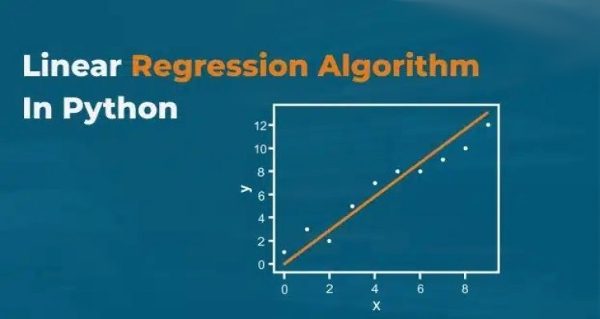

# Linear Regression Calculator

A simple and efficient linear regression calculator with both GUI and command-line interfaces.

## Features

- Simple linear regression implementation
- Graphical User Interface (GUI) with matplotlib visualization
- Command-line interface for scripting and automation
- Input validation and error handling
- Support for both single and multiple predictions

## Installation

1. Clone the repository:
```bash
git clone https://github.com/AkashicRecords/Linear_Regression_Calculator.git
cd Linear_Regression_Calculator
```

2. Install required dependencies:
```bash
pip install numpy matplotlib
```

## Usage

### GUI Interface

Run the graphical interface:
```bash
python Lin_Calc_GUI.py
```

### Command Line Interface

1. Fit the model with data:
```bash
python Lin_Calc_CLI.py --fit --x "1,2,3,4,5" --y "2,4,5,4,5"
```

2. Make predictions:
```bash
python Lin_Calc_CLI.py --predict 6
```

3. Fit and predict in one command:
```bash
python Lin_Calc_CLI.py --fit --x "1,2,3,4,5" --y "2,4,5,4,5" --predict 6
```

## Requirements

- Python 3.6+
- NumPy
- Matplotlib (for GUI)
- tkinter (for GUI, usually comes with Python)

## License

MIT License 